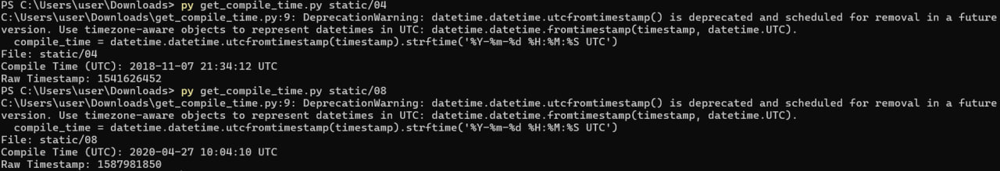

# Khasanova_UN_135

Файлы: 04, 08

## 1. Контрольные суммы файлов

Контрольные суммы рассчитаны с помощью Powershell: 
```
$files = @("04", "08")

foreach ($file in $files) {
    Write-Output "`nКонтрольные суммы файла $file ==="
    foreach ($algo in @("MD5", "SHA1", "SHA256", "SHA384", "SHA512")) {
        $hash = Get-FileHash -Path $file -Algorithm $algo
        Write-Output "$($algo): $($hash.Hash)"
    }
}
```

Результат: 


## 2. Детектирование файла

Для детектирования были использованы YARA-правила [отсюда](https://github.com/YARA-Rules/rules?tab=readme-ov-file#packers), каждое из них применялось к файлам с помощью [python-скрипта](src/yara_scan.py).

### 2.1. Результаты для файла 04


На основании результатов YARA-сканирования можно сделать вывод, что файл `04` — это исполняемый Windows-файл (PE32), который содержит характерные признаки вредоносного ПО:

    - сработали правила на работу с файловой системой (`win_files_operation`) на API -- `CreateFileA`, `ReadFile`, `WriteFIle`, `SetFilePointer`, `FindClose`

    - сработали правила `SEH_Save`, `SEH_Init` на манипуляции с sctructured exception handling для обхода отладчиков; `anti_dbg` содержит вызов `IsDebuggerPresent` из ` KERNEL32.dll`

    - правило `maldoc_find_kernel32_base_method_1` сработало, т.к. код парсит PE-заголовки

    - `IsPE32` говорит о том, что файл является 32-битным  Windows-исполняемым (.exe или .dll)

    - `IsConsole` -- приложение с консольным интерфейсом 


### 2.2. Результаты для файла 08


Файл `08` — это упакованный исполняемый файл Windows (PE32). Результат также содержит признаки, что файл является вредоносным: 

  - сработали правила `UPX`, `UPXV200V290MarkusOberhumerLaszloMolnarJohnReiser` -- это указывает на то, что файл сжат с помощью упаковщика UPXl, он легален, но вредоносные файлы используют его, чтобы затруднить статический анализ и/или обойти антивирусы 

  - сработало правило  `yodas_Protector_v1033_dllocx_Ashkbiz_Danehkar_h` -- указывает на `Yoda’s Protector` — протектор, часто используемый в мальваре

  - правило `suspicious_packer_section` -- обнаружены секции с подозрительными именами (например, .upx, .packed), нехарактерные для обычных программ

  - правило `IsPacked` подтверждает упаковку

  - правило `IsBeyondImageSize` сигнализирует, что данные в PE-файле выходят за пределы объявленного размера образа, что типично для ручной упаковки/переполнения секций

  - правила `IsPE32`, `HasRichSignature` говорят о том, что это обычный Windows-исполняемый файл (32-битный); сам по себе признак не говорит о вредоносности, но настораживает в сочетании с упаковкой

  - правило `maldoc_getEIP_method_1` -- обнаружена техника получения EIP

  - правило `IsConsole` -- приложение является консольным, может быть скриптом, лоадером, бэкдором или утилитой командной строки 

## 3. Формат файла 

С помощью [python-скрипта](src/filetype_chech.py) проанализировала некоторые популярные магические сигнатуры.

Результат: 


На основании результата можно сделать следующий вывод:

 - Файл `04` -- 32-битный исполняемый файл Windows (PE32, консольное приложение). Компилятор: Собран с помощью Microsoft Visual C++ 8.0 (Visual Studio 2005–2008).

- Файл `08` -- тоже PE32-исполняемый файл (консольное приложение Windows), обнаружена сигнатура UPX — файл сжат с помощью упаковщика UPX

## 4. Дата компиляции файлов 

Определялась с помощью утилиты `pefile` и [python-скрипта](src/get_compile_time.py).

Результат: 



## 5. Список импортируемых библиотек и функций

Также определялся с помощью `pefile` и [python-скрипта](src/list_imports.py)

### 5.1 Результат для файла 04: 

```
PS C:\Users\user\Downloads> py list_imports.py static/04
Imports from: static/04

    KERNEL32.dll
    GetStdHandle
    GetConsoleScreenBufferInfo
    SetConsoleTitleA
    SetConsoleTextAttribute
    WriteConsoleA
    ReadConsoleA
    CreateFileA
    WriteFile
    CloseHandle
    CreateProcessW
    CreateNamedPipeA
    ConnectNamedPipe
    Sleep
    ReadFile
    DisconnectNamedPipe
    TerminateProcess
    SetFilePointerEx
    QueryPerformanceCounter
    GetCurrentProcessId
    GetCurrentThreadId
    GetSystemTimeAsFileTime
    InitializeSListHead
    IsDebuggerPresent
    UnhandledExceptionFilter
    SetUnhandledExceptionFilter
    GetStartupInfoW
    IsProcessorFeaturePresent
    GetModuleHandleW
    GetCurrentProcess
    RaiseException
    RtlUnwind
    GetLastError
    SetLastError
    EnterCriticalSection
    LeaveCriticalSection
    DeleteCriticalSection
    InitializeCriticalSectionAndSpinCount
    TlsAlloc
    TlsGetValue
    TlsSetValue
    TlsFree
    FreeLibrary
    GetProcAddress
    LoadLibraryExW
    GetDriveTypeW
    GetFullPathNameW
    ExitProcess
    GetModuleHandleExW
    GetModuleFileNameA
    MultiByteToWideChar
    WideCharToMultiByte
    GetCommandLineA
    GetCommandLineW
    GetACP
    HeapFree
    HeapAlloc
    GetCurrentDirectoryW
    CreateFileW
    GetConsoleMode
    ReadConsoleInputW
    SetConsoleMode
    FindClose
    FindFirstFileExA
    FindNextFileA
    IsValidCodePage
    GetOEMCP
    GetCPInfo
    GetEnvironmentStringsW
    FreeEnvironmentStringsW
    SetEnvironmentVariableA
    SetStdHandle
    GetFileType
    GetStringTypeW
    CompareStringW
    LCMapStringW
    GetProcessHeap
    WriteConsoleW
    HeapSize
    HeapReAlloc
    FlushFileBuffers
    GetConsoleCP
    DecodePointer
```

### 5.2 Результат для файла 08:

```

PS C:\Users\user\Downloads> py list_imports.py static/08
Imports from: static/08

    KERNEL32.DLL
    LoadLibraryA
    ExitProcess
    GetProcAddress
    VirtualProtect

    MSVCP120.dll
    ?_Xbad_alloc@std@@YAXXZ

    MSVCR120.dll
    exit
```

## 6. Строки, указывающие на функциональность файла

На основе всех найденных строк (см. вывод yara-сканирования: [04](src/yara_scan_04.txt), [08](src/yara_scan_08.txt)) можно указать все найденные строки, которые могут указывать на функциональность файла.

### 6.1. Строки, указывающие на функциональность файла `04`
#### 6.1.1 Антиотладочные функции

    - `IsDebuggerPresent` — стандартная Windows API-функция для проверки наличия отладчика

    - `KERNEL32.dll` — DLL, в которой находится IsDebuggerPresent

#### 6.1.2. Работа с файловой системой

    - `CreateFileA`

    - `ReadFile`

    - `WriteFile`

    - `SetFilePointer`

    - `FindClose`

#### 6.1.3. Информация о компиляторе и сборке

    - `Rich` — сигнатура компоновщика Microsoft

    - `VC8_Microsoft_Corporation`

    - `Microsoft_Visual_Cpp_8`

#### 6.1.4. Поведенческие паттерны
    - `IpILqI` — характерная сигнатура позиционно-независимого кода, часто используемая в shellcode

    - `8I8I8I8I8I` — повторяющийся паттерн, часто встречающийся в расшифровщиках или декомпрессорах

    - `1~` — зашифрованные или упакованные данные

### 6.2. Строки, указывающие на функциональность файла `08`
#### 6.2.1. Упакован с помощью UPX

    - `UPX0`

    - `UPX1`

    - `UPX!`

#### 6.2.2. Другие признаки

    - `Rich` — файл был собран с помощью Microsoft Visual Studio, но это не противоречит мальвару (многие мальвар-фреймворки используют MSVC)

## 8. Вывод о функциональности файлов 
### 8.1 Файл `04`

    Файл `04` представляет собой вредоносный стейджер или лоадер. Он способен обходить анализ и работать с файлами

### 8.2 Файл `08`

    Файл `08` — это упакованный вредоносный файл, скрытый за двойным слоем защиты: UPX-упаковка: сигнатуры UPX0, UPX1, UPX! подтверждают сжатие с помощью известного упаковщика; доп. протектор: срабатывание правила yodas_Protector_v1033... указывает на применение второго уровня обфускации — практика, характерная для ВПО