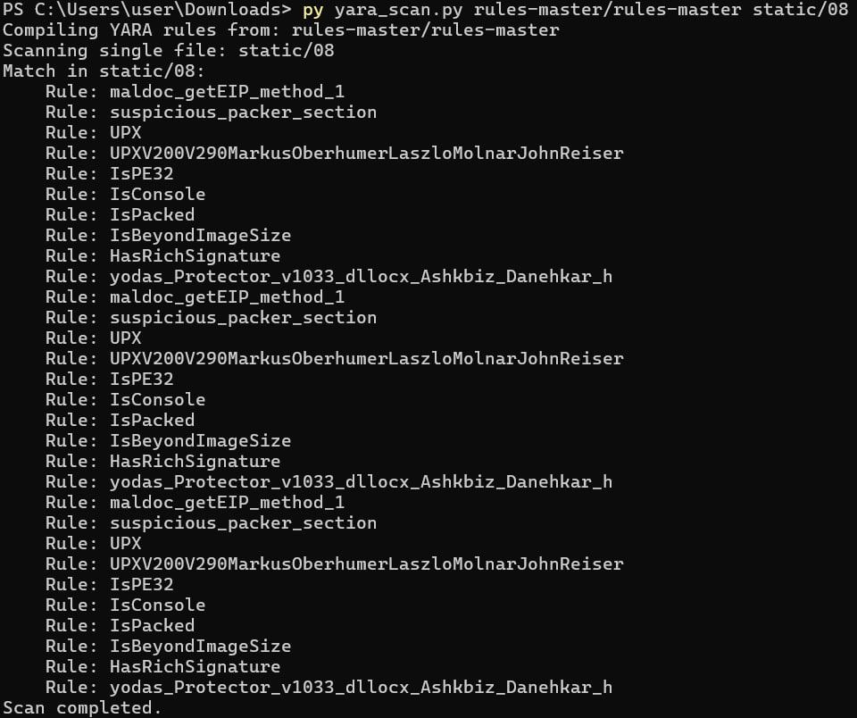

# KhasanovaUN135

Файлы: 04, 08

1) Контрольные суммы файлов 

Команда: 
```
$files = @("04", "08")

foreach ($file in $files) {
    Write-Output "`nКонтрольные суммы файла $file ==="
    foreach ($algo in @("MD5", "SHA1", "SHA256", "SHA384", "SHA512")) {
        $hash = Get-FileHash -Path $file -Algorithm $algo
        Write-Output "$($algo): $($hash.Hash)"
    }
}
```

Результат: 


2) Детектирование файла

для детектирования были использованы YARA-правила [отсюда](https://github.com/YARA-Rules/rules?tab=readme-ov-file#packers)
каждое из них применялось к файлам с помощью python-скрипта

2.1. Результаты для файла 04

2.1. Результаты для файла 08

